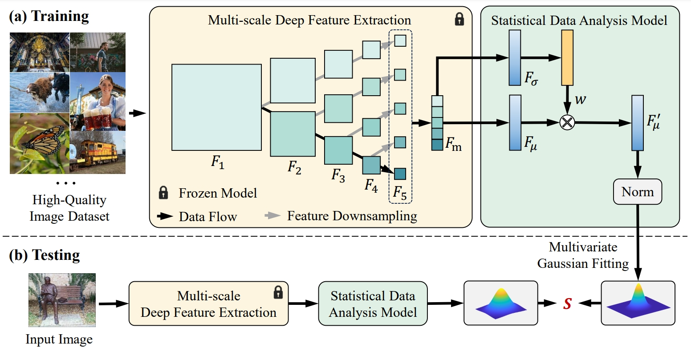
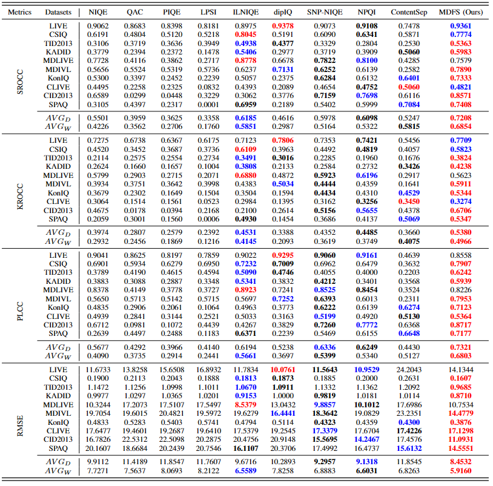

# Opinion-Unaware Blind Image Quality Assessment using Multi-Scale Deep Feature Statistics

<!-- **The IEEE Transactions on Multimedia (T-MM)** -->
#### IEEE Transactions on Multimedia (T-MM)

[Zhangkai Ni](https://eezkni.github.io/)<sup>1</sup>, [Yue Liu](https://scholar.google.com.tw/citations?user=w6vLxPkAAAAJ&hl=zh-CN)<sup>2</sup>, [Keyan Ding](https://github.com/dingkeyan93)<sup>3</sup>, [Wenhan Yang](https://flyywh.github.io/)<sup>4</sup>, [Hanli Wang](https://mic.tongji.edu.cn/51/91/c9778a86417/page.htm)<sup>1</sup>, [Shiqi Wang](https://www.cs.cityu.edu.hk/~shiqwang/)<sup>2</sup>

<sup>1</sup>Tongji University, <sup>2</sup>City University of Hong Kong, <sup>3</sup>Zhejiang University, <sup>4</sup>Peng Cheng Laboratory

This repository provides the official PyTorch implementation for the paper “Opinion-Unaware Blind Image Quality Assessment using Multi-Scale Deep Feature Statistics”, TMM.

## About MDFS

Deep learning-based methods have significantly influenced the blind image quality assessment (BIQA) field, however, these methods often require training using large amounts of human rating data. In contrast, traditional knowledge-based methods are cost-effective for training but face challenges in effectively extracting features aligned with human visual perception. To bridge these gaps, we propose integrating deep features from pre-trained visual models with a statistical analysis model into a Multi-scale Deep Feature Statistics (MDFS) model for achieving opinion-unaware BIQA (OU-BIQA), thereby eliminating the reliance on human rating data and significantly improving training efficiency. Specifically, we extract patch-wise multi-scale features from pre-trained vision models, which are subsequently fitted into a multivariate Gaussian (MVG) model. The final quality score is determined by quantifying the distance between the MVG model derived from the test image and the benchmark MVG model derived from the high-quality image set. A comprehensive series of experiments conducted on various datasets show that our proposed model exhibits superior consistency with human visual perception compared to state-of-the-art BIQA models. Furthermore, it shows improved generalizability across diverse target-specific BIQA tasks. </br>


### Framework
<!--  -->
<div align=center></div>


### Experimental Results
<div align=center></div>


## Quick Start

### Requirements:

- Python>=3.6
- Pytorch>=1.0

### Train:

- Download the dataset and put it in the `data` folder. The training data can be downloaded from [here](https://drive.google.com/file/d/1pNTjX5zdwdEzz8yAzTMcx5cvGF_v2k0R/view?usp=sharing). Then run the following command:

```python
python train.py
```

### Test:

- Download the pre-trained model from [here](https://drive.google.com/file/d/1HQq5l9kwhCPByY_6sHPqPveNcBY6-1O6/view?usp=sharing) and put it in the same folder as the `test.py` file. Then run the following command:

```python
python test.py
```


## Citation

If you find our work useful, please cite it as

```
@article{ni2024opinion,
  title={Opinion-Unaware Blind Image Quality Assessment using Multi-Scale Deep Feature Statistics},
  author={Zhangkai Ni, Yue Liu, Keyan Ding, Wenhan Yang, Hanli Wang, and Shiqi Wang},
  journal={IEEE Transactions on Multimedia},
  year={2024}
}
```

## Contact

Thanks for your attention! If you have any suggestion or question, feel free to leave a message here or contact Dr. Zhangkai Ni (eezkni@gmail.com).


## License

[MIT License](https://opensource.org/licenses/MIT)

